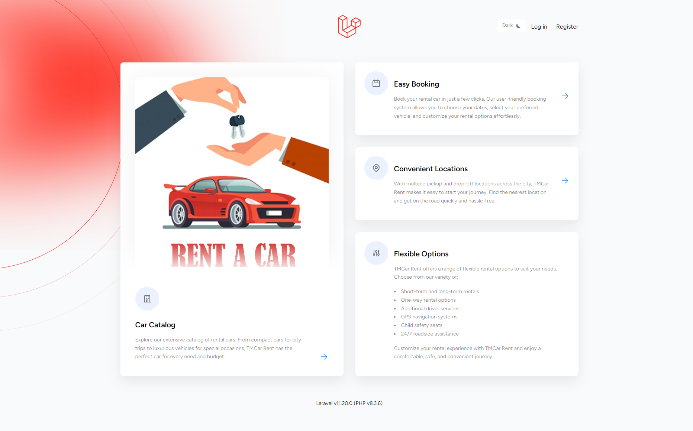
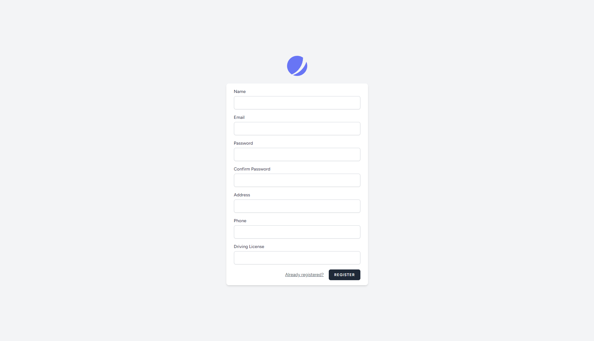
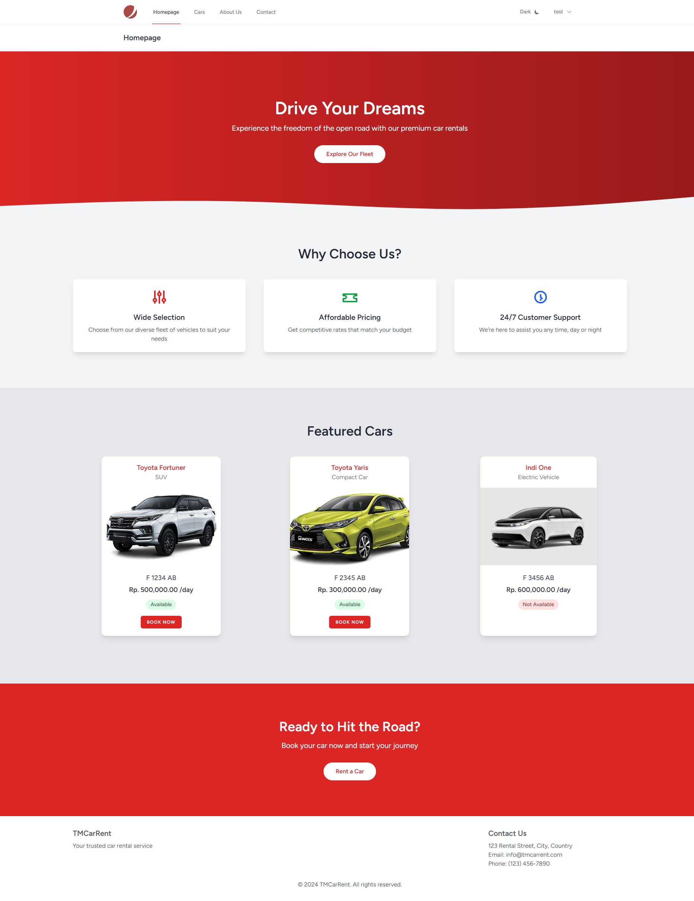
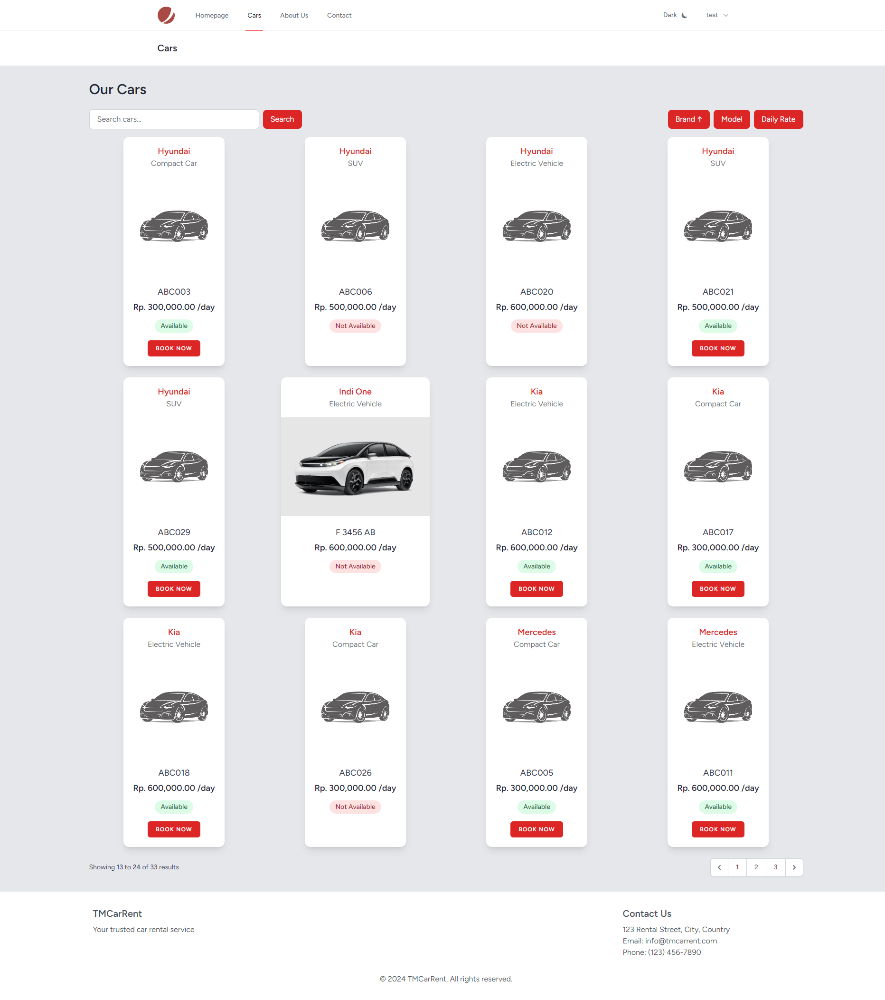
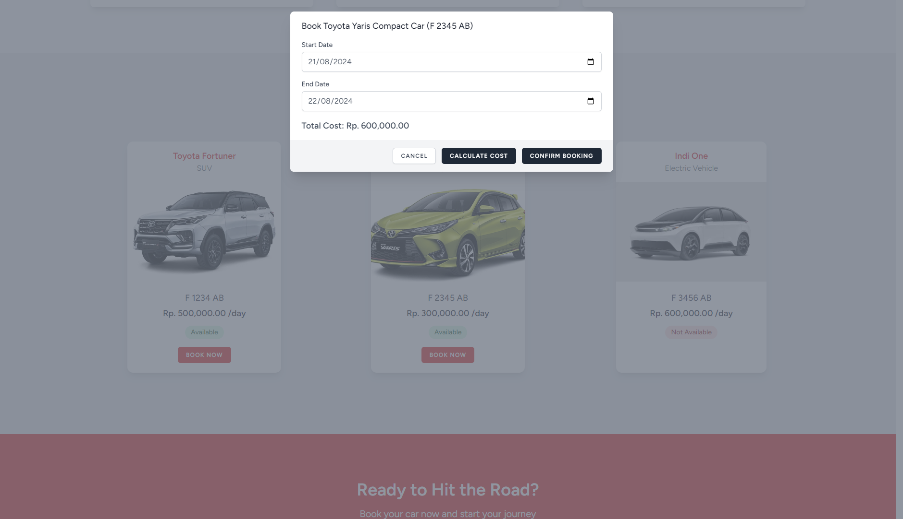
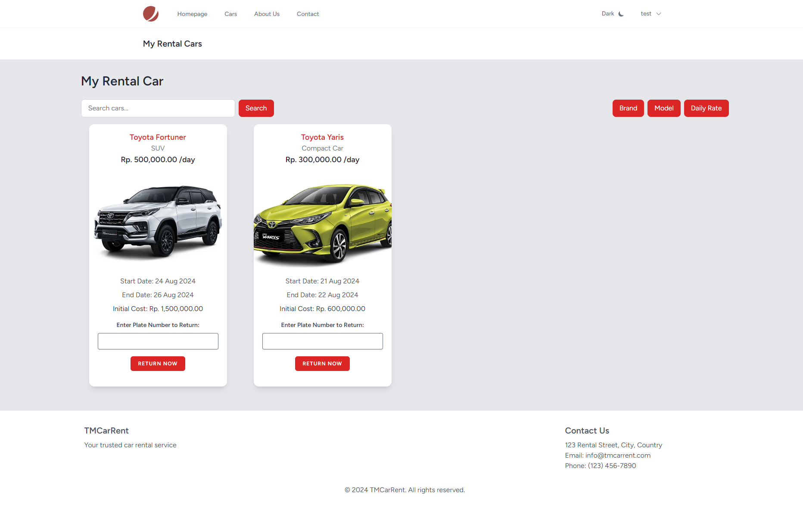
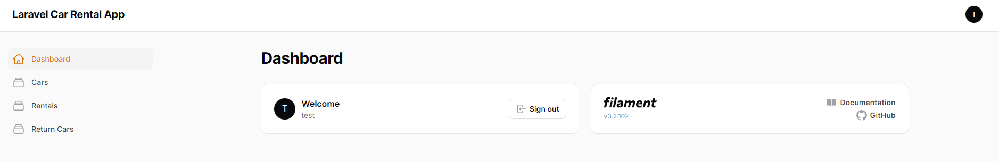
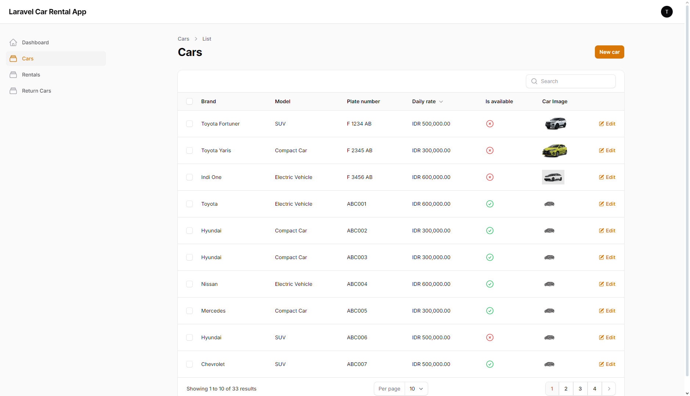
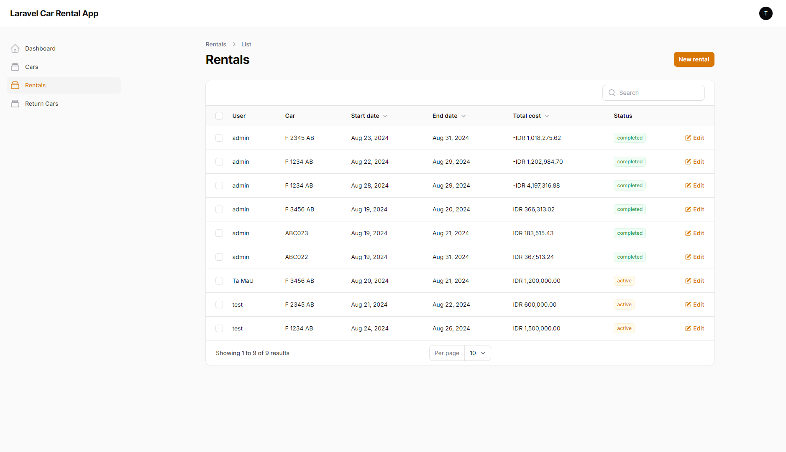
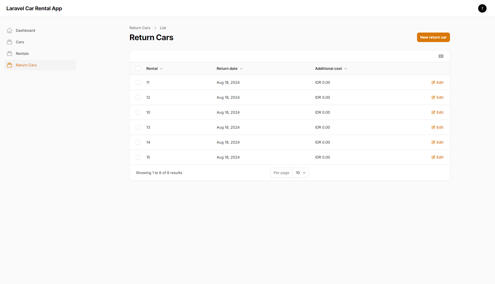

# Car Rental Application

This project is a car rental management system built with Laravel 11, leveraging modern web technologies to provide a robust and user-friendly experience.

## Features

- User Registration and Authentication
- Car Management
- Rental Booking System
- Car Return Processing
- User Dashboard
- Dark/Light Mode Toggle

## Technologies Used

- [Laravel 11](https://laravel.com/docs/11.x): A powerful PHP framework for web artisans
- [Jetstream](https://jetstream.laravel.com/): Laravel's authentication starter kit
- [Filament](https://filamentphp.com/): Rapidly build TALL-stack admin panels
- [Livewire](https://laravel-livewire.com/): Full-stack framework for dynamic interfaces
- [Tailwind CSS](https://tailwindcss.com/): A utility-first CSS framework
- [Laragon](https://laragon.org/): Modern & Powerful Local Development Environment
- [MySQL](https://www.mysql.com/): Open-source relational database management system

## Prerequisites

- PHP >= 8.2
- Composer
- Node.js & NPM
- Laragon (or similar local development environment)
- MySQL

## Installation

1. Clone the repository:
   ```
   git clone https://github.com/TMaulana26/car-rental-app.git
   ```

2. Navigate to the project directory:
   ```
   cd car-rental-app
   ```

3. Install PHP dependencies:
   ```
   composer install
   ```

4. Install NPM packages:
   ```
   npm install
   ```

5. Create a copy of the `.env.example` file:
   ```
   cp .env.example .env
   ```

6. Generate an application key:
   ```
   php artisan key:generate
   ```

7. Configure your database settings in the `.env` file

8. Run database migrations:
   ```
   php artisan migrate
   ```

9. Build assets:
   ```
   npm run dev
   ```

10. Start the development server:
    ```
    php artisan serve
    ```

## Usage

Visit `http://localhost:8000` in your web browser to access the application.

## License

This project is licensed under the MIT License - see the [LICENSE.md](LICENSE.md) file for details.

## Acknowledgments

- [Laravel Documentation](https://laravel.com/docs)
- [Jetstream Documentation](https://jetstream.laravel.com/introduction.html)
- [Filament Documentation](https://filamentphp.com/docs)
- [Livewire Documentation](https://laravel-livewire.com/docs)

## Screenshots

Here are some screenshots of the application:


*Welcome of the Car Rental Application*


*Registration page of the Car Rental Application*


*Homepage of the Car Rental Application*


*Available Cars Listing Page*


*Car Booking Process*


*User Dashboard showing current rentals*





*Admin Dashboard*